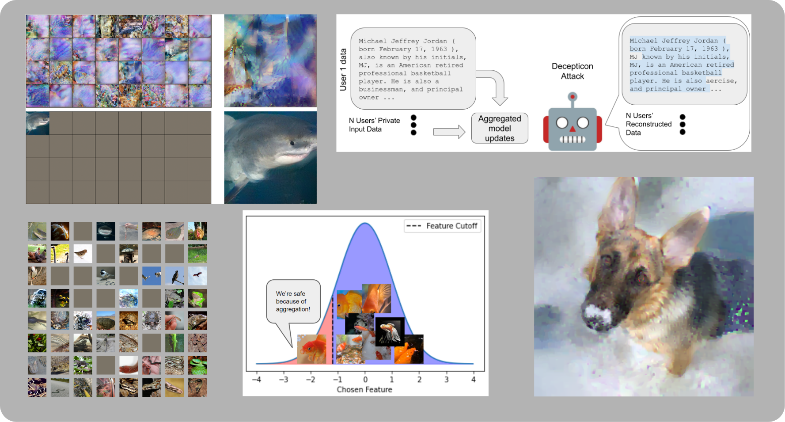

以下是翻译后的中文 README 文件内容：

---

# Breaching - 一个针对联邦学习中隐私攻击的框架

该 PyTorch 框架实现了一系列梯度反演攻击，旨在 *突破* 联邦学习场景中的隐私保护，涵盖了小规模和大规模聚合场景，以及视觉和文本领域的攻击示例。



该框架包括以下最新研究的实现：
* **恶意模型攻击**（Malicious-model attacks），详细描述于论文 ["Robbing The Fed"](https://openreview.net/forum?id=fwzUgo0FM9v)
* **针对 Transformer 结构的攻击**（Attacks against transformer architectures），描述于论文 ["Decepticons"](https://arxiv.org/abs/2201.12675)
* **对任意聚合方式的 Fishing 攻击**（Fishing attacks that breach arbitrary aggregations），描述于 [这篇论文](https://arxiv.org/abs/2202.00580)

此外，该框架还实现了多种优化攻击（如 "Inverting Gradients" 和 "See through Gradients"）以及近期的分析攻击和递归攻击。相关的 Jupyter Notebook 示例可在 `examples/` 目录中找到。

## 概述：
该存储库包含两个主要组件：
1. **攻击模块**（位于 `breaching.attacks`）：包含多个模块化的攻击方法。
2. **用例模块**（位于 `breaching.cases`）：包含不同的威胁模型、用户设置、模型架构和数据集。

所有攻击方法和场景均高度模块化，可以通过 `breaching/config` 进行自定义和扩展。

### 安装
你可以通过 `git clone` 下载整个存储库（包含示例和 Jupyter Notebook），或者直接安装 Python 包：
```bash
pip install breaching
```
以便轻松访问主要功能。

由于该框架涉及视觉和自然语言处理（NLP）等多个领域，因此其依赖项较多。完整的依赖列表位于 `environment.yml`，可以使用以下命令通过 conda 安装：
```bash
conda env create --file environment.yml
```
默认情况下，并不会安装所有依赖项，你可以根据需要选择性安装（例如，如果只对 NLP 应用感兴趣，可以仅安装 Hugging Face 相关的库）。

安装完成后，可以运行以下命令验证安装是否成功：
```bash
python simulate_breach.py dryrun=True
```
该命令会在单次迭代下测试最简单的重建设置。

### 使用方法
可以通过以下方式加载某个用例：
```python
cfg_case = breaching.get_case_config(case="1_single_imagenet")
user, server, model, loss = breaching.cases.construct_case(cfg_case)
```
加载攻击方法：
```python
cfg_attack = breaching.get_attack_config(attack="invertinggradients")
attacker = breaching.attacks.prepare_attack(model, loss, cfg_attack)
```
你可以打印出当前加载的威胁模型和场景信息，以便进行调整：
```python
breaching.utils.overview(server, user, attacker)
```
然后模拟一次联邦学习（FL）交互：
```python
shared_user_data, payloads, true_user_data = server.run_protocol(user)
```
最后运行攻击（该过程仅使用用户更新数据和服务器状态）：
```python
reconstructed_user_data, stats = attacker.reconstruct(payloads, shared_user_data)
```
更详细的示例请参考 `examples/` 目录中的 Jupyter Notebook，或 `simulate_breach.py` 以及 `minimal_example.py` 和 `minimal_example_robbing_the_fed.py`。

### 该框架的作用
该框架是一个模块化的攻击集合，旨在研究如何利用用户上传到中央服务器的更新数据来 **恢复用户的私有数据**。该框架涵盖了梯度更新、多轮本地训练更新，并支持语言和视觉数据集。对于每种攻击方式（如是否需要标签、数据点数量等），框架明确了威胁模型的要求，并包含现代初始化方法和标签恢复策略。

我们特别关注**每种攻击的威胁模型**，并限制 `attacker` 仅能基于 `shared_user_data`（即用户传输的数据）进行攻击。所有攻击应尽可能独立于具体用例，仅依赖这些有限的数据传输信息。此外，攻击方法的实现不应涉及具体的用例，同样，新的用例的实现也应完全独立于攻击部分。所有内容均可通过 `hydra` 配置语法进行高度定制。

### 该框架不包括哪些内容？
该框架仅专注于 **攻击**，不包含任何防御方法（除了用户级差分隐私和聚合机制）。我们的目标是研究 **当前攻击能在哪些场景下生效**，以及 **攻击的极限在哪里**。因此，该框架中的 FL（联邦学习）模拟是“浅层”的 —— 实际上 **并不会训练模型**，我们仅研究固定的模型检查点（可在其他地方生成）。如果你希望研究完整的 FL 训练协议以及防御方法，推荐参考 [GradAttack](https://github.com/Princeton-SysML/GradAttack) 等存储库。

### 攻击方法
所有包含的攻击方法及其原始论文参考可在 `examples/README.md` 中找到。

### 数据集
多数视觉攻击示例使用 `ImageNet` 数据集。要运行这些示例，你需要**手动**下载 *ImageNet ILSVRC2012* 数据集。不过，大多数攻击仅需使用 **小型验证集**，可以直接下载到笔记本电脑，而无需完整的训练集。如果无法使用 `ImageNet`，则可以使用 `Birdsnap` 数据集作为替代方案。此外，默认情况下，我们仅使用 `ImageNetAnimals`（ImageNet 的前 397 个类别），以减少涉及真实人类的图片数量。

其他可用的数据集包括 `CIFAR10` 和 `CIFAR100`。在 FL 训练模拟中，这些数据集可使用 `data.partition` 进行不同方式的划分，例如：
* `random`（随机划分，无数据重复）
* `balanced`（均匀划分类别）
* `unique-class`（每个用户仅拥有一个类别的数据）

在更改数据划分方式时，可能需要调整 `data.default_clients`（即客户端数量）。

对于语言数据，框架支持：
* `wikitext`（按文章划分用户）
* `stackoverflow` 和 `shakespeare`（来自 TensorFlow Federated，已预先划分用户）

你也可以跳过 `breaching.cases` 模块，使用自己的代码加载模型和数据集，示例见 `minimal_example.py`。

## 评估指标
框架实现了一系列隐私攻击评估指标，可通过 `breaching.analysis.report` 调用。其中一些指标（如 CW-SSIM 和 R-PSNR）需要额外安装依赖项。对于 NLP 数据，我们集成了 Hugging Face 的多个评估指标。然而，我们强调 **这些指标仅能反映部分隐私泄露情况**，应谨慎使用。

## 其他主题

### 基准测试（Benchmarking）
框架提供了 `benchmark_breaches.py` 脚本，用于批量测试攻击效果。例如，默认情况下，基于优化的攻击在 **单块 GTX2080 GPU 上运行一天**，而基于分析的攻击 **不到 30 分钟** 即可完成。

所有实验结果存储在 `outputs/` 目录，包括日志、度量指标和恢复的数据。汇总表格存储在 `tables/` 目录。

### 系统要求
所有攻击均可在 **CPU/GPU** 上运行（任何 `torch.device` 均可）。但优化攻击计算量较大，建议使用 **GPU** 运行。而基于分析的攻击（如 Decepticon 攻击）主要依赖 CPU，因此也可在 CPU 上运行。

### 选项配置
建议查看 `breaching/config` 目录，了解所有可用配置选项。

### 参考文献
请引用各攻击方法的原始论文，并在附录或补充材料中注明使用了本框架。

### 许可
本项目整合了多个开源代码片段，详细许可信息见 `LICENCE.md`。

### 作者
本框架由 [Jonas Geiping](https://github.com/JonasGeiping)、[Liam Fowl](https://github.com/lhfowl) 和 [Yuxin Wen](https://github.com/YuxinWenRick) 在马里兰大学学院公园分校开发。

### 贡献
欢迎提交 PR，或联系我们探讨新的攻击方法或用例。

### 联系方式
如果有任何问题，请在 GitHub 上提交 issue，或直接发送邮件联系我们。